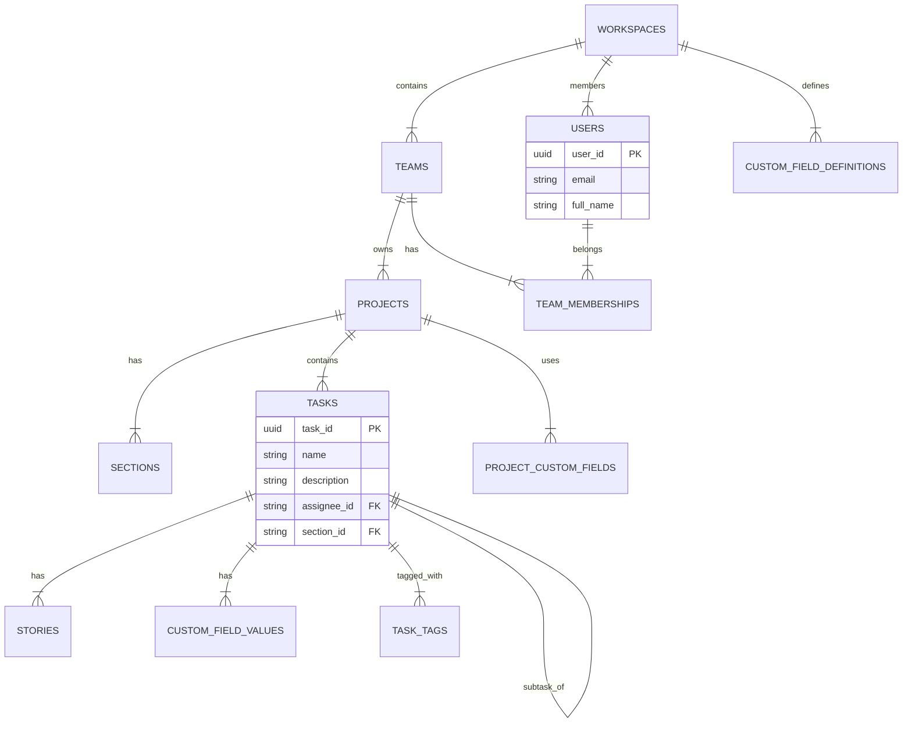

# Asana Simulation Documentation

## Section A: Database Schema

This simulation uses a relational SQLite database designed to mirror Asana's core object model.

### Entity-Relationship Diagram (ERD)
*Note: This description corresponds to the `schema.sql` file.*

### Entity-Relationship Diagram (ERD)

*Note: This diagram represents the core relationships found in `schema.sql`.*

### Design Decisions
1.  **Custom Fields (EAV)**: Implemented using an Entity-Attribute-Value model (`custom_field_definitions`, `custom_field_values`) to support Asana's flexible per-project field schema.
2.  **Task Hierarchy**: Subtasks are modeled in the same `tasks` table using a self-referencing FK `parent_task_id`, allowing infinite nesting depth.
3.  **UUIDs**: All primary keys are UUIDv4 (`TEXT`) to mimic Asana's global ID system and allow distributed generation.

---

## Section B: Seed Data Methodology

### 1. Data Sources
- **Users**: Generated using weighted Census name data (`census_names.csv`) and `Faker` for realistic profiles.
- **Companies**: Real Y-Combinator company names scraped from public directories (`yc_companies.csv`).
- **Tasks**:
    - **Engineering**: Patterns scraped from GitHub Issues (`github_issues.csv`).
    - **Marketing**: Campaign templates (`marketing_tasks.csv`).
    - **General**: Operational task patterns (`general_tasks.csv`).
- **Job Titles**: Weighted distribution based on a typical SaaS org structure.
- **LLM**: Optional integration with Google Gemini for rich text descriptions.

### 2. Distribution Strategy
| Table | Strategy | Justification |
|Ref|---|---|
| **Users** | Linear Growth + Noise | Simulates company hiring ramp over 5 years. |
| **Tasks** | Per-Project Distribution | 10-30 tasks per project match typical "active" project sizes. |
| **Dates** | Temporal Integrity | `created_at` < `completed_at` enforced. Dates exclude future (unless due dates). |
| **Status** | Weighted Random | 15% Completed, 50% On Track, etc. reflects a snapshot of an active workspace. |

### 3. LLM Integration
When an API key is present (`GEMINI_API_KEY`), the system enriches task descriptions and comments using `gemini-2.0-flash-exp`.
- **Prompt**: "Write a 2 sentence description for this task"
- **Temperature**: 0.7 (for variety)
- **Fallback**: Pre-written string templates are used if the API is unavailable.
