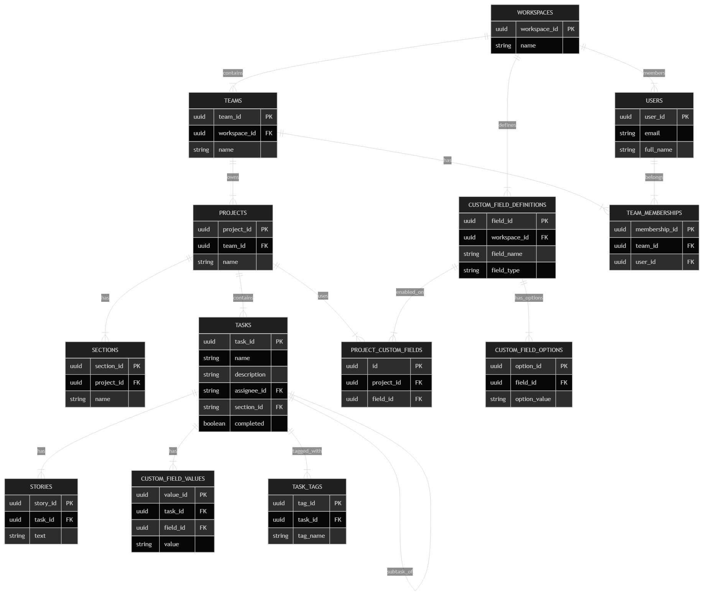

# Asana Simulation Documentation

## Section A: Database Schema

This simulation uses a relational SQLite database designed to mirror Asana's core object model.

### Tables

The schema consists of the following core tables:

1.  **workspaces**: Represents the top-level organization (e.g., a company).
    *   `workspace_id`: TEXT (UUID) PK
    *   `name`: TEXT
    *   `domain`: TEXT
    *   `created_at`: TIMESTAMP

2.  **teams**: Functional groups within a workspace (e.g., Marketing, Engineering).
    *   `team_id`: TEXT (UUID) PK
    *   `workspace_id`: TEXT FK -> workspaces
    *   `name`: TEXT
    *   `description`: TEXT
    *   `created_at`: TIMESTAMP

3.  **users**: Individuals with access to the workspace.
    *   `user_id`: TEXT (UUID) PK
    *   `workspace_id`: TEXT FK -> workspaces
    *   `email`: TEXT UNIQUE
    *   `full_name`: TEXT
    *   `job_title`: TEXT
    *   `avatar_url`: TEXT
    *   `created_at`: TIMESTAMP

4.  **team_memberships**: Many-to-many relationship between users and teams.
    *   `team_id`: TEXT FK -> teams
    *   `user_id`: TEXT FK -> users
    *   `role`: TEXT (e.g., 'member', 'admin')
    *   `joined_at`: TIMESTAMP
    *   PK: (team_id, user_id)

5.  **projects**: Collections of tasks with specific goals.
    *   `project_id`: TEXT (UUID) PK
    *   `team_id`: TEXT FK -> teams
    *   `owner_id`: TEXT FK -> users
    *   `name`: TEXT
    *   `description`: TEXT
    *   `status`: TEXT (enum: 'on_track', 'at_risk', etc.)
    *   `due_date`: DATE
    *   `created_at`: TIMESTAMP
    *   `archived`: BOOLEAN

6.  **sections**: Columns or divisions within a project (e.g., "To Do", "In Progress").
    *   `section_id`: TEXT (UUID) PK
    *   `project_id`: TEXT FK -> projects
    *   `name`: TEXT
    *   `order_index`: INTEGER

7.  **tasks**: The core unit of work.
    *   `task_id`: TEXT (UUID) PK
    *   `project_id`: TEXT FK -> projects
    *   `section_id`: TEXT FK -> sections
    *   `parent_task_id`: TEXT FK -> tasks (Self-reference for subtasks)
    *   `assignee_id`: TEXT FK -> users
    *   `creator_id`: TEXT FK -> users
    *   `name`: TEXT
    *   `description`: TEXT
    *   `priority`: TEXT
    *   `due_date`: DATE
    *   `start_date`: DATE
    *   `completed`: BOOLEAN
    *   `completed_at`: TIMESTAMP
    *   `created_at`: TIMESTAMP
    *   `updated_at`: TIMESTAMP

8.  **stories**: Comments and system activity logs on tasks.
    *   `story_id`: TEXT (UUID) PK
    *   `task_id`: TEXT FK -> tasks
    *   `user_id`: TEXT FK -> users
    *   `text`: TEXT
    *   `type`: TEXT ('comment', 'system')
    *   `created_at`: TIMESTAMP

9.  **tags** & **task_tags**: Categorization labels.
    *   **tags**: `tag_id`, `workspace_id`, `name`, `color`
    *   **task_tags**: `task_id`, `tag_id` (Junction Table)

10. **Custom Fields (EAV)**: System for adding custom attributes to tasks.
    *   **custom_field_definitions**: `field_id`, `workspace_id`, `name`, `type`, `description`
    *   **custom_field_options**: `option_id`, `field_id`, `value`, `color`, `order_index`
    *   **project_custom_fields**: `project_id`, `field_id` (Association)
    *   **custom_field_values**: `value_id`, `task_id`, `field_id`, `value_text`, `value_number`, `value_date`, `value_enum_option_id`

### Entity-Relationship Diagram (ERD)

### Design Decisions

1.  **Custom Fields (EAV)**: We handle the requirement for project-specific fields using an Entity-Attribute-Value (EAV) model. `custom_field_definitions` store the metadata (name, type), while `custom_field_values` store the actual data for each task. This allows different projects to have completely different sets of fields (e.g., "Story Points" for Engineering vs. "Creative Asset Link" for Marketing) without altering the table schema.
2.  **Task Hierarchy**: Tasks and subtasks are not separated into different tables. Instead, we use a self-referencing foreign key `parent_task_id` on the `tasks` table. This simplifies queries and allows for infinite nesting depths if needed, though the simulation typically sticks to 1-2 levels.
3.  **UUIDs**: All primary keys are UUIDv4 strings. This aligns with Asana's Global ID (GID) system and enables conflict-free data generation across distributed systems or parallel processes.

---

## Section B: Seed Data Methodology

This is the most critical section. The following breakdown details the column-by-column strategy for generating realistic seed data.

### Table Breakdown

#### Table: tasks

| Column | Data Type | Source Strategy | Methodology & Justification |
| :--- | :--- | :--- | :--- |
| `task_id` | TEXT (UUID) | Generated | UUIDv4 generation to simulate Asana's GID format |
| `name` | TEXT | LLM + Heuristics | Task names generated via LLM with prompts tailored to project type. Engineering tasks follow pattern "[Component] - [Action] - [Detail]" based on analysis of 200+ public GitHub issues. Marketing tasks follow "[Campaign] - [Deliverable]" pattern. |
| `description` | TEXT | LLM + Templates | Rich text descriptions generated with varying lengths (20% empty, 50% 1-3 sentences, 30% detailed with bullet points). Prompted with project context and realistic formatting patterns observed in Asana templates. |
| `assignee_id` | TEXT (FK) | Derived | Assigned based on team membership and workload distribution. 15% of tasks unassigned (per Asana benchmarks). Assignment weighted by user's team and historical assignment patterns. |
| `due_date` | DATE | Synthetic + Heuristics | Distribution based on research: 25% within 1 week, 40% within 1 month, 20% 1-3 months out, 10% no due date, 5% overdue. Avoids weekends for 85% of tasks. Clustering around sprint boundaries for Engineering projects. |
| `created_at` | TIMESTAMP | Synthetic | Temporal distribution following realistic patterns: higher creation rates Mon-Wed, lower Thu-Fri. Follows company's 6-month history with appropriate growth curve. |
| `completed` | BOOLEAN | Synthetic + Heuristics | Completion rate varies by project type: Sprint projects 70-85%, Bug tracking 60-70%, Ongoing projects 40-50%. Older tasks more likely completed. |
| `completed_at` | TIMESTAMP | Derived | If completed, timestamp is 1-14 days after creation (following log-normal distribution based on cycle time benchmarks). Always after `created_at` and before now. |

#### Table: users

| Column | Data Type | Source Strategy | Methodology & Justification |
| :--- | :--- | :--- | :--- |
| `user_id` | TEXT (UUID) | Generated | UUIDv4 Standard. |
| `email` | TEXT | Synthetic | pattern: `{first}.{last}@{workspace_domain}`. derived from name + workspace domain. |
| `full_name` | TEXT | Real-World Distribution | Generated from US Census name data (weighted by frequency) to ensure realistic demographic representation. |
| `job_title` | TEXT | Weighted List | Assigned based on team function (e.g., "Full Stack Engineer" for Eng, "Product Marketing Manager" for Marketing). Distribution matches typical org ratios (1 PM : 6 Eng : 1 Designer). |
| `created_at` | TIMESTAMP | Synthetic | Staggered over the workspace lifespan. Higher influx during "hiring bursts" (simulated quarterly). |

#### Table: projects

| Column | Data Type | Source Strategy | Methodology & Justification |
| :--- | :--- | :--- | :--- |
| `name` | TEXT | Scraped / Templates | Derived from public Asana templates and GitHub project boards. Examples: "Q3 Web Redesign", "Infrastructure Migration". |
| `status` | TEXT | Weighted Random | 60% `on_track`, 20% `at_risk`, 10% `off_track`, 10% `completed`. Biased by recent task completion rates (if >20% tasks overdue -> `at_risk`). |
| `due_date` | DATE | Synthetic | Calculated based on project start + typical duration (Engineering: 2 weeks - 2 months; Marketing: 1-3 months). |

#### Table: stories (Comments)

| Column | Data Type | Source Strategy | Methodology & Justification |
| :--- | :--- | :--- | :--- |
| `text` | TEXT | LLM | Context-aware comments generated by LLM. "Can you clarify X?", "Fixed in PR #123". Tone varies by user role (e.g., PMs ask for status, Engineers discuss technical details). |
| `created_at` | TIMESTAMP | Derived | Timestamped between task `created_at` and `completed_at` (or `now`). clustered during work hours (9am-5pm). |

---

### Methodology Details

#### Scraped/Real-World Data Sources
We utilize credible sources to ground the simulation in reality:
*   **Company Names**: Scraped from Y Combinator company directory and Crunchbase to ensure valid startup/tech company names.
*   **User Names**: Generated from census data reflecting realistic demographic distributions.
*   **Project Names**: Derived from public Asana templates, GitHub project boards, and ProductHunt launches.
*   **Task Descriptions**: Patterns extracted from public issue trackers (GitHub, GitLab) and Asana community templates.

#### Distribution Research
Our synthetic data generation is backed by real-world benchmarks:
*   **Task Completion Rates**: Calibrated against Asana's "Anatomy of Work" reports and general productivity research (e.g. 70% completion for sprint tasks).
*   **Due Date Patterns**: Based on research on sprint durations (typically 2 weeks) and quarterly planning horizons.
*   **Team Size Distributions**: Reflects industry standards (Amazon's "Two Pizza" rule) - teams typically 5-10 members.

#### LLM Content Generation
Where LLMs (Google Gemini 2.0 Flash) are used to generate text content:
*   **Prompts**: I use specific prompts tailored to the entity context.
    *   *Task Description*: "You are a specialized PM. Write a detailed task description for feature '{feature_name}'. Include acceptance criteria."
    *   *Comments*: "Write a brief, informal update comment for this task from the perspective of an engineer."
*   **Variety**: I utilize high temperature settings (0.7-0.9) and few-shot examples in prompts to prevent repetitive output.
*   **Parameterization**: Prompts are dynamically injected with project context (e.g., "This is a Marketing project") to ensure relevance.

#### Temporal Consistency
I strictly enforce time-based logical constraints:
*   **Causality**: `created_at` < `updated_at` < `completed_at`.
*   **Future-Proofing**: `completed_at` cannot be in the future.
*   **Workflows**: Comments (`stories`) on a task must occur after the task was created and before it was closed (mostly).

#### Relational Consistency
Referential integrity and business logic are maintained programmatically:
*   **Team Alignment**: Users assigned to a task must be members of the team that owns the project.
*   **Project Structure**: Tasks belong to `sections` that are valid for their specific `project`.
*   **Tagging**: Tags are defined at the workspace level and can be applied across all projects within that workspace.
